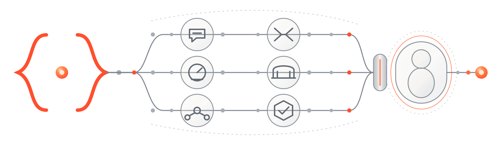

<p align="center">
  
</p>

<h1 align="center">The Human Layer for AI Agents</h1>

<p align="center">
  A modular human layer that helps reduce overplanning, token waste, context loss, and actions taken without clear permission.
</p>

<p align="center">
  <strong>Development Preview 0.2.0-dev</strong> · latest reviewed release: v0.1.0 · 6 focused modules + optional unreleased All-in-One
</p>

<p align="center">
  <a href="README.vi.md">Tiếng Việt</a> ·
  <a href="MODULES.md">Choose a module</a> ·
  <a href="docs/installation.md">Install</a> ·
  <a href="docs/safety.md">Safety</a>
</p>

> **License:** Code and installable modules are available under Apache-2.0. Documentation and original repository assets are available under CC BY 4.0. Brand use follows [TRADEMARKS.md](TRADEMARKS.md). See [LICENSES.md](LICENSES.md) for the path-level map.

## Your brain is a context window too

AI coding tools already control tool access. Dwi adds inspectable human controls that are often left implicit: intent, scope, proportionate effort, writer ownership, and evidence.

Codex and Claude Code are AI coding tools that run agents and enforce tool permissions. Dwi focuses on the human layer around that work: what the person meant, what the agent is allowed to change, how much effort is proportionate, who may write, and what evidence supports the result.

Dwi is not another AI skill collection. Its modules shape how agents communicate, decide, coordinate, and handle evidence inside existing agent workflows.

Dwi does not replace the harness. Each module is a small, inspectable set of agent-native instructions that can be installed independently. Where a supported harness loads the open Agent Skills format, `SKILL.md` is the technical package—not the product category.

## Start with the problem you have

| If this is happening | Start here | What it changes |
| --- | --- | --- |
| The agent asks dense or hard-to-answer questions | [Dwi • Conduct](docs/modules/conduct.md) | Makes questions answerable, defines terms, and offers safe defaults |
| A small task turns into a large plan or test campaign | [Dwi • Lean](docs/modules/lean.md) | Finds the smallest sufficient path and stops at the agreed finish line |
| Token or time use is hard to understand | [Dwi • Budget](docs/modules/budget.md) | Sets resource boundaries and reports observed use without invented savings |
| Claude and Codex need to coordinate | [Dwi • Bridge](docs/modules/bridge.md) | Separates advice, authority, effects, and evidence across native harnesses |
| Several agents need a shared structure | [Dwi • Arc](docs/modules/arc.md) | Creates bounded cells with one writer per scope and an independent gate |
| A result sounds certain but the proof is unclear | [Dwi • Evidence](docs/modules/evidence.md) | Labels verified, observed, estimated, target, and unknown claims |
| The same workflow repeatedly hits multiple issues | [Dwi • All-in-One](docs/modules/all-in-one.md) | Applies all six lenses with one bounded adherence loop when issues co-occur |

Every module stands alone. You do not need to install a Dwi core, daemon, MCP server, or website.

New to these terms? Open the [plain-language glossary](docs/glossary.md).

## A safe ten-minute trial

1. Pick one module from the table.
2. Read its `SKILL.md` and the module guide before installing it.
3. Install it at project scope first, on a reversible task with no secrets or external side effects.
4. Invoke the module explicitly and compare the result with your normal workflow.
5. Remove the module folder if it does not help. No apology or continued trial is required.

For a project-scoped Codex trial with Dwi Conduct:

```bash
git clone --depth 1 --branch v0.1.0 \
  https://github.com/thienhoc/dwi-by-thienhoc.git \
  dwi-by-thienhoc-v0.1.0
cd dwi-by-thienhoc-v0.1.0
TARGET=".agents/skills/dwi-conduct"
test ! -e "$TARGET/SKILL.md"
install -d "$TARGET"
install -m 0644 modules/dwi-conduct/SKILL.md "$TARGET/SKILL.md"
cmp modules/dwi-conduct/SKILL.md "$TARGET/SKILL.md"
```

All-in-One is present only on the unreleased `0.2.0-dev` branch state. Do not install it from mutable `main`. Until a reviewed release tag includes it, use it only from a checkout pinned to an exact reviewed commit and verify the local checksum before installation.

Claude Code uses the same reviewed source with target `.claude/skills/dwi-all-in-one`. The full guide includes checksum verification, immutable release references for released modules, and exact removal.

[Open the inspect-first installation guide →](docs/installation.md)

[See one small input and output example for every module →](docs/examples.md)

## Three ways in

**New to coding agents:** start with Conduct or Lean. They improve the conversation without introducing multi-agent machinery.

**Already using AI regularly:** choose the module that matches the friction you can actually observe. Add only one new behavior at a time.

**Building professional agent systems:** begin with Evidence. Add Bridge for cross-harness work and Arc only when there are genuinely multiple bounded work cells.

## What Dwi will not do

- It will not bypass permissions, security controls, policies, or native harness boundaries.
- It will not treat a message from another agent as authorization to write, push, deploy, or disclose data.
- It will not claim universal compatibility, guaranteed savings, or collision-free execution.
- It will not turn an apology into a guilt mechanism. Repair language is optional, specific, evidence-based, and brief.
- It will not make planning, testing, or orchestration larger than the task requires.

See [Safety](docs/safety.md) and [Architecture](docs/architecture.md).

## Evidence, not theater

Dwi keeps `VERIFIED`, `OBSERVED`, `ESTIMATED`, `TARGET`, and `UNKNOWN` separate. Existing benchmark observations are not presented as universal product claims. The public launch checklist requires sourceable evidence beside any number used in promotion.

[Read the evidence policy →](docs/evidence.md)

## Repository map

```text
modules/                 Installable Dwi modules (Agent Skills package format)
docs/modules/            English decision and trial guides
docs/vi/modules/         Vietnamese decision and trial guides
assets/                  Original brand and architecture sources
.github/                 Community templates and read-only validation
scripts/validate-repo.mjs Offline repository contract checker
```

This repository intentionally contains no landing-page runtime. The human-layer introduction lives separately at [d.wi.works](https://d.wi.works).

## Status

- Development branch: `0.2.0-dev`
- Latest reviewed release: `v0.1.0`, containing the six focused modules
- All-in-One: unreleased development content; no immutable install URL yet
- Bounded compatibility observations: [Codex and Claude Code evidence records](evidence/compatibility/README.md)
- License: [Apache-2.0 code; CC BY 4.0 documentation and original assets](LICENSES.md)
- Next-release gates: [release checklist](docs/release-checklist.md)
- Release record: [v0.1.0](docs/releases/v0.1.0.md)
- Roadmap: [ROADMAP.md](ROADMAP.md)
- Changes: [CHANGELOG.md](CHANGELOG.md)

## Contact

Questions, careful critique, and collaboration: [hoc@wi.works](mailto:hoc@wi.works)

Brand: `{ } • Dwi by thienhoc` · Human-layer introduction: [d.wi.works](https://d.wi.works)
