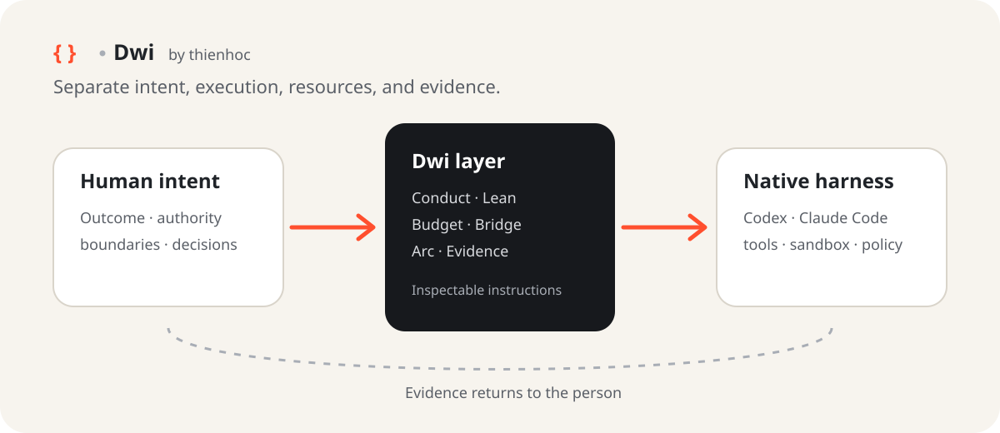

# Architecture: native harness, Dwi layer, human intent

Dwi sits between human intent and a native coding-agent harness as inspectable instructions. It does not proxy model traffic, replace permission systems, or require a coordinator service.

## Four separations

| Layer | Question |
| --- | --- |
| Intent | What outcome does the person want, and what remains their decision? |
| Execution | Which harness or agent may act, and within what scope? |
| Resources | How much time, context, testing, and coordination is proportionate? |
| Evidence | What is verified, observed, estimated, targeted, or still unknown? |

## Module placement

- Conduct protects the intent interface.
- Lean bounds execution depth.
- Budget makes resource use explicit.
- Bridge coordinates native harnesses without turning advice into authority.
- Arc structures multiple bounded work cells.
- Evidence protects the result interface.

## One-writer rule

Parallel reading is usually safe. Parallel mutation is safe only when scopes are explicitly disjoint. Each mutable scope has one owner, one acceptance contract, and one handoff point. The root integrator decides what enters the shared result.

## No hidden core

There is no required Dwi runtime. A module is a directory containing `SKILL.md`; optional harness metadata may sit beside it. Removing that directory removes the module's instructions from the selected scope.

## Compatibility boundary

The repository documents Codex and Claude Code skill locations because both support directory-based Agent Skills. Actual behavior still depends on the installed harness version, model, project instructions, and permission settings. Compatibility must be checked on a bounded trial; it is not assumed.
